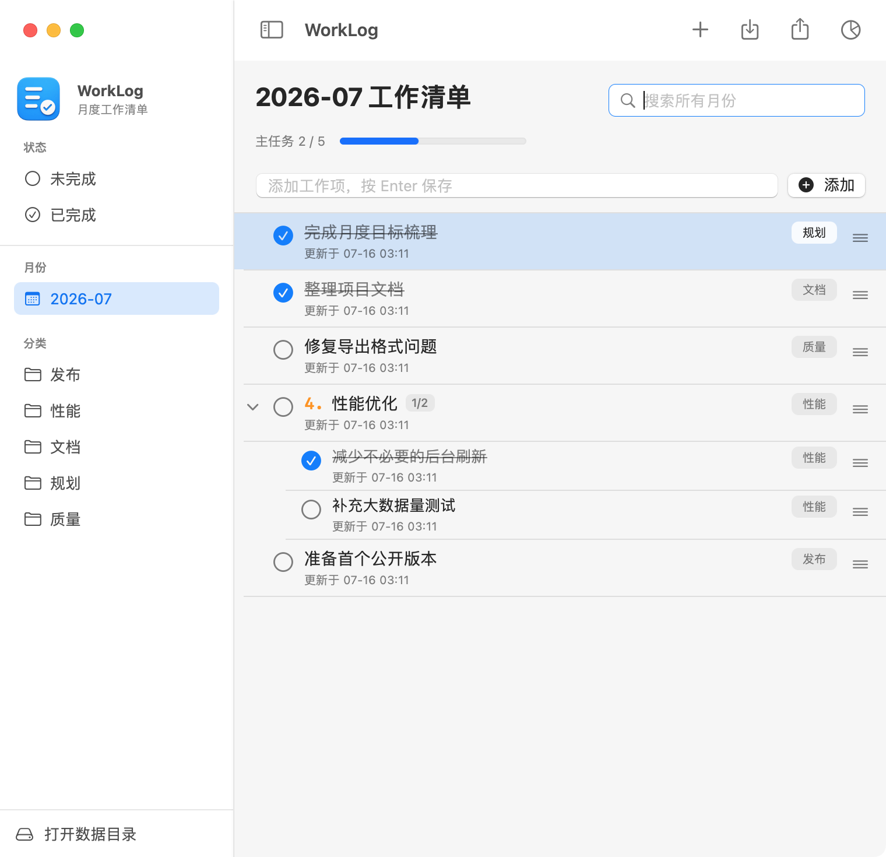

# WorkLog

[简体中文](README.md) | [English](README.en.md)

[](https://github.com/0x2a94b5/worklog-macos/actions/workflows/ci.yml)

WorkLog is a native macOS monthly work log app built with SwiftUI, AppKit, and the system SQLite library. It supports macOS 12 and later.

The app is designed for people who organize work by month and prefer native interaction, local data ownership, and low resource usage during long-running sessions.



## Features

- Filter tasks by month, category, and incomplete/completed status
- Create hierarchical tasks, collapse task groups, and reorder siblings with drag and drop
- Select with a single click and edit titles or categories with a double click
- Navigate with arrow keys, toggle completion with Space, and edit with Return
- Search globally and jump directly to a result
- Create the current month automatically
- Append tasks from Markdown without replacing existing data
- Export standard Markdown without internal metadata such as categories, notes, or timestamps
- Store data locally in SQLite with migrations, transactions, cross-day rolling backups, and recovery
- Restore a permanently deleted task with `Command-Z` during the current session
- Generate and copy a monthly review

The app interface is currently Chinese-first. File formats, keyboard interaction, source code, and documentation are accessible to English-speaking contributors.

## Markdown Format

```markdown
2026-07
---
[x]Completed task
[ ]Incomplete task
4. Parent task
   - [ ] Child task
```

When fields are missing during import, status defaults to incomplete, category defaults to Uncategorized, notes remain empty, and timestamps use the import time. Import only appends to the selected month. Edit an existing task from the checklist when changes are required.

## Build

### Requirements

- macOS 12 or later
- Xcode 14.2 or later

### Clone

```bash
git clone https://github.com/0x2a94b5/worklog-macos.git
cd worklog-macos
```

### Xcode

Open `WorkLog.xcodeproj`, select the `WorkLog` scheme and `My Mac`, then run the app.

### Command Line

```bash
xcodebuild \
  -project WorkLog.xcodeproj \
  -scheme WorkLog \
  -configuration Debug \
  -derivedDataPath build/DerivedData \
  CODE_SIGNING_ALLOWED=NO \
  build
```

The local debug app is generated at:

```text
build/DerivedData/Build/Products/Debug/WorkLog.app
```

Run core regression tests with:

```bash
zsh Tests/run_core_tests.sh
```

Run the startup smoke test and input interaction test with:

```bash
zsh Tests/run_app_smoke_test.sh
zsh Tests/run_ui_interaction_test.sh
```

The UI interaction test uses an isolated temporary database and does not read or modify production data. The terminal running it needs macOS Accessibility permission.

Production distribution requires Developer ID signing, Hardened Runtime, and Apple notarization. The unsigned local build is intended only for development and verification.

## Data and Backups

Database:

```text
~/Library/Application Support/WorkLog/worklog.sqlite
```

Database backups:

```text
~/Library/Application Support/WorkLog/Backups/Database/
```

WorkLog creates one complete SQLite backup per day and retains the latest 14 backups. During long-running sessions, it checks in the background after a calendar-day change, wake, or app activation. It also backs up the database before migrations. If the database cannot be opened, WorkLog offers a recovery view that validates internal backups and preserves the failed database before replacement. Markdown export is a readable interchange copy and does not replace a full database backup.

WorkLog does not use a network service. Tasks, categories, and backups remain on the local Mac. See the [Privacy Notice](PRIVACY.en.md) for details. The public repository contains generic examples and demonstration screenshots only; it does not include user databases, backups, or real work records.

## Project Structure

```text
WorkLog/
├── App/              App lifecycle and menus
├── Models/           Month, task, and status models
├── Database/         SQLite wrapper, migrations, and backups
├── Repositories/     Data access and transactions
├── Services/         Markdown parsing, monthly summaries, and category defaults
├── ViewModels/       UI state and application operations
├── Views/            SwiftUI views
└── Utilities/        Date utilities
```

## Contributing

Read the [English contributing guide](CONTRIBUTING.en.md) or the [Chinese contributing guide](CONTRIBUTING.md). Run the core regression tests and a Debug build before submitting changes.

## License

WorkLog is available under the [MIT License](LICENSE).
